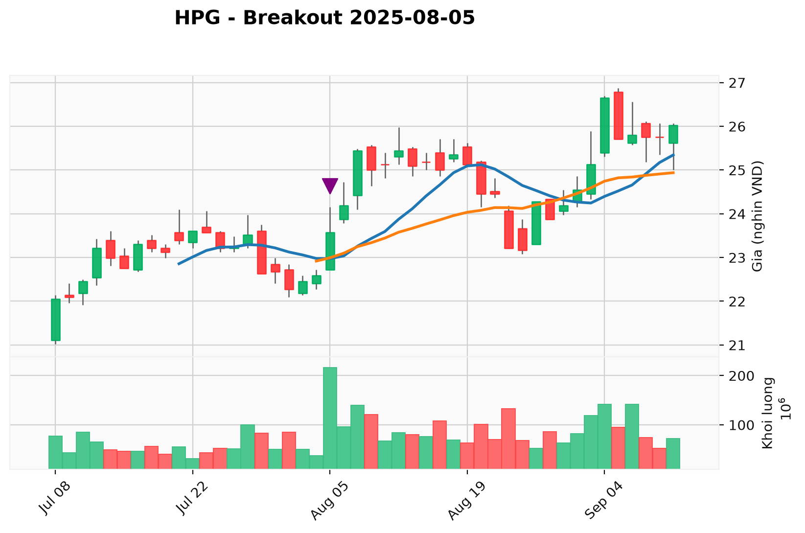

# Vietnam Stock Breakout Analyzer (HPG Analysis)

Hệ thống tự động tải dữ liệu lịch sử giá chứng khoán Việt Nam, trích xuất đặc trưng khối lượng (Feature Engineering), phát hiện các phiên bùng nổ dòng tiền (Breakout) và tự động xuất biểu đồ kỹ thuật.

## 1. Cấu trúc thư mục
```text
MoneyTest/
├── data/          # Dữ liệu giá OHLCV dạng CSV
├── images/        # Biểu đồ nến kỹ thuật đã xuất
├── src/           # Mã nguồn Python (fetch_data, features, chart_zoom)
├── requirements.txt
└── README.md
```

## 2. Cài đặt & Chạy
```bash
pip install -r requirements.txt
py src/fetch_data.py
py src/features.py
py src/chart_zoom.py
```

## 3. Biểu đồ nổ khối lượng tiêu biểu (Breakout 05/08/2025 - HPG)
